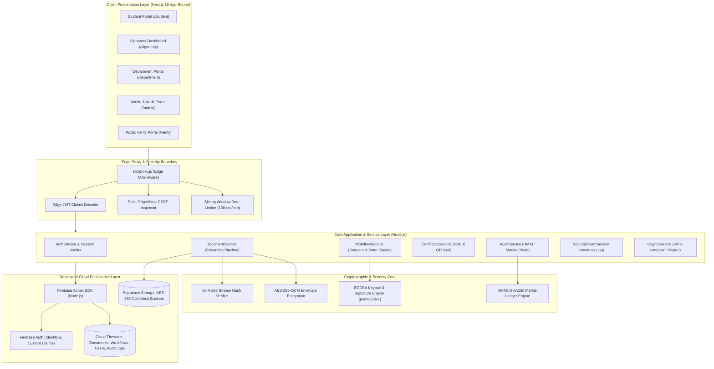
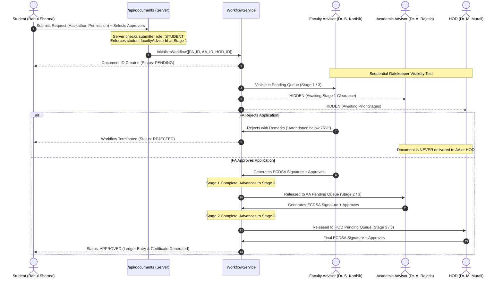
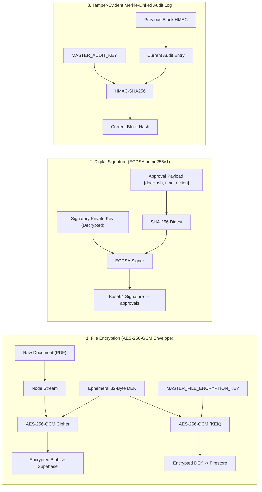
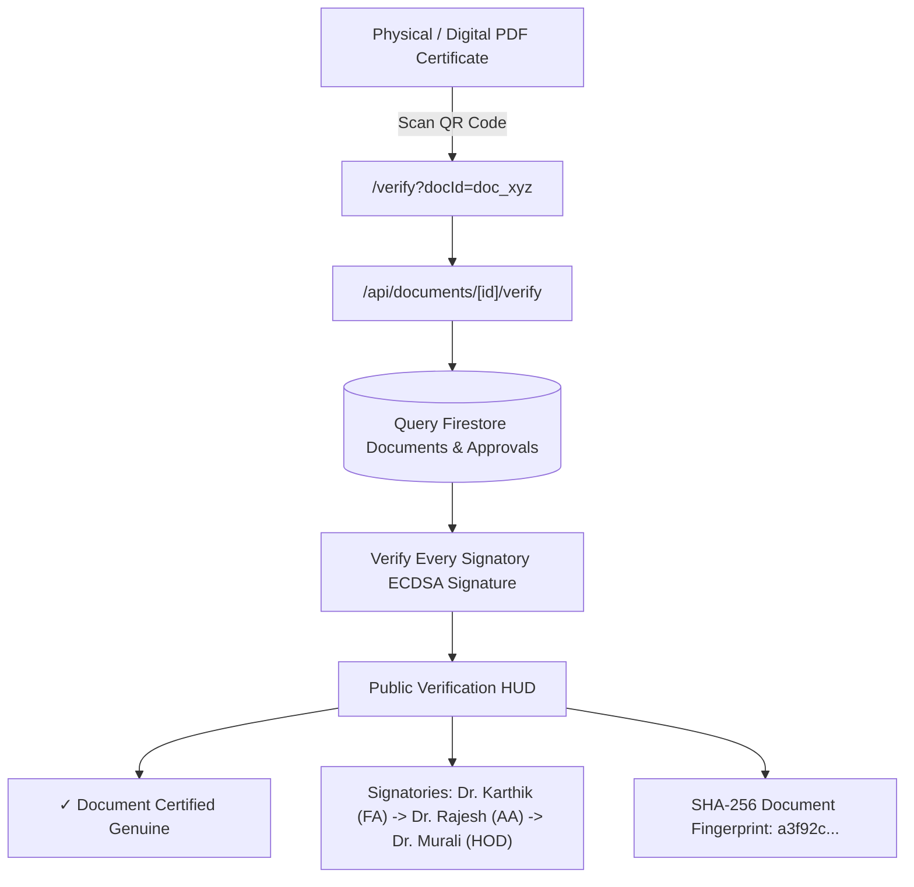

# 🏛️ SRM Digital Document Approval & Verification Platform (SRM DGV)
## Comprehensive System Architecture, Cybersecurity Specification & Threat Model
### The Official Technical Master Handbook for SRM Institute of Science and Technology

> **Institution:** SRM Institute of Science and Technology, Kattankulathur (SRM KTR), Chennai  
> **Faculty:** School of Computing (SOC)  
> **Production Repository:** [https://github.com/Frostyanand/srm-dgv](https://github.com/Frostyanand/srm-dgv)  
> **Platform Version:** 2.4.0-Enterprise (SRM Edition)  
> **Classification:** Technical Documentation / Hackathon Grand Presentation Guide  
> **Target Audience:** Hackathon Judges, University Leadership, Technical Evaluators, Development Team  

---

## 📑 Master Table of Contents
1. [Executive Summary & Problem Statement](#1-executive-summary--problem-statement)
2. [SRM KTR Institutional Hierarchy & Domain Model](#2-srm-ktr-institutional-hierarchy--domain-model)
3. [End-to-End System Architecture](#3-end-to-end-system-architecture)
4. [Codebase Organization & Architecture Mapping](#4-codebase-organization--architecture-mapping)
5. [Complete API & Database Schema Specification](#5-complete-api--database-schema-specification)
6. [The Mandatory FA Gatekeeper Protocol](#6-the-mandatory-fa-gatekeeper-protocol)
7. [The 15 Seeded SRM Workflow Templates](#7-the-15-seeded-srm-workflow-templates)
8. [Comprehensive Cybersecurity & Cryptography Breakdown](#8-comprehensive-cybersecurity--cryptography-breakdown)
9. [Detailed Threat Model & Defense Matrix (8 Threat Actors)](#9-detailed-threat-model--defense-matrix-8-threat-actors)
10. [End-to-End User Journeys (All 5 Roles)](#10-end-to-end-user-journeys-all-5-roles)
11. [Public Verification & Forensic Ledger Engine](#11-public-verification--forensic-ledger-engine)
12. [Hackathon Live Demo Runbook & Pitching Guide](#12-hackathon-live-demo-runbook--pitching-guide)

---

## 1. Executive Summary & Problem Statement

### 1.1 The Institutional Challenge at SRM Institute of Science and Technology
In premier engineering institutions of colossal scale like **SRM Institute of Science and Technology (Kattankulathur Campus)**—where the **School of Computing** alone accommodates over 15,000 engineering undergraduates, 150+ class sections, 4 specialized engineering departments, and over 400 faculty members—the conventional paper-based document approval workflow is fundamentally broken:

1. **The Physical "Signature Hunt" (Paper Chasing):**
   Students spend days running between campus towers (Tech Park, Basic Engineering Building, Directorate) searching for Section Faculty Advisors, Academic Advisors, Heads of Department, and the Dean to secure manual signatures and rubber stamps. A single On-Duty (OD) form can take 4 to 7 working days.
2. **Endemic Forgery & Rubber Stamp Counterfeiting:**
   Physical signatures, initials, and institutional seals are trivially forged, photocopied, or traced. Students routinely fake OD clearances, medical certificates, bonafide letters, or event sponsorship approvals without detection until attendance discrepancies or financial audits surface months later.
3. **The "Spam & Irrelevance" Epidemic at Senior Leadership Levels:**
   In physical and unmanaged digital workflows (like direct emails), students bypass immediate mentors and send trivial, unvetted, or malformed requests directly to senior administrators (Deans, Chairpersons, and HODs). This inundates senior leadership with administrative noise, creating decision paralysis.
4. **Total Absence of Real-Time Traceability & Accountability:**
   Once a physical file is submitted to a departmental clerk or left on a professor's desk, it enters a blind spot. Students have zero visibility into which desk their file is stuck on, and faculty members face no accountability or audit trail for overdue clearances.
5. **Zero External Verifiability for Third Parties:**
   When an SRM student presents an approval letter, bonafide certificate, or NOC to an external entity (hackathon organizers, partner universities, visa consulates, law enforcement, or funding agencies), the third party has no mathematical way to confirm whether the document was legitimately issued or fabricated in Photoshop.

---

### 1.2 The SRM DGV Solution
**SRM DGV (Digital Document Governance & Verification)** is an enterprise-grade, zero-trust digital approval platform engineered specifically for the governance demands of large-scale higher education institutions:

* **Military-Grade Envelope Encryption (AES-256-GCM):** Files are encrypted in transit and at rest using ephemeral, per-document Data Encryption Keys (DEKs) wrapped by a Master Key Encryption Key (KEK). Storage providers (Supabase) store only high-entropy encrypted blobs—they possess zero knowledge of institutional data.
* **Cryptographic Non-Repudiation (ECDSA Curve `prime256v1`):** Every approval or rejection is sealed with the signatory's unique Elliptic Curve Digital Signature. Signatures are mathematically bound to the SHA-256 fingerprint of the document version and timestamp. Approvers cannot deny their actions.
* **The Mandatory FA Gatekeeper Protocol:** Submissions from students are structurally and cryptographically locked to their assigned Section Faculty Advisor (FA) at Stage 1. Higher authorities (AAs, HODs, Deans) are completely shielded from unvetted student applications until the FA passes the document through the gatekeeper.
* **Tamper-Evident Merkle-Linked Audit Ledger:** Every state transition, document inspection, approval, and administrative action is logged into a blockchain-style audit ledger where each record is cryptographically linked to the previous block using **HMAC-SHA256**. Any retroactive database tampering immediately breaks the chain.
* **Instant Forensic Public Verification:** Approved documents automatically generate an official PDF Certificate of Completion with a dynamic QR code. Anyone in the world can scan the QR code to verify the document's authenticity, view the complete signatory roster, and inspect cryptographic signature hashes in real time without creating an account.

---

## 2. SRM KTR Institutional Hierarchy & Domain Model

The platform mathematically models the exact organizational governance hierarchy of **SRM Institute of Science and Technology (School of Computing, Kattankulathur Campus)**:

```
                            SRM IST (KTR Campus)
                                     │
                        ┌────────────┴────────────┐
                Other Schools (SOE, SME)    School of Computing (SOC)
                                                   │
                  ┌────────────────────────────────┴────────────────────────────────┐
                  │                                                                 │
       Dean, School of Computing                                        Chairperson / Assoc. Chairperson
       (Dr. Revathi Venkataraman)                                      (Dr. C. Lakshmi / Dr. M. Pushpalatha)
                  │
   ┌──────────────┼──────────────────────────────┬──────────────────────────────┐
   │              │                              │                              │
 CTech          CIntel                         NWC                            DSBS
 Computing    Computational                 Networking &                   Data Science &
 Technologies  Intelligence                 Communications                 Business Systems
 (Dr. Murali) (Dr. Annie Uthra)             (Dr. Annapurani)               (Dr. Vadivu)
   │              │                              │                              │
   ├─ 4 AAs       ├─ 4 AAs                       ├─ 4 AAs                       ├─ 4 AAs
   │ (1st-4th Yr) │ (1st-4th Yr)                 │ (1st-4th Yr)                 │ (1st-4th Yr)
   │              │                              │                              │
   └─ 45 FAs      └─ 40 FAs                      └─ 35 FAs                      └─ 35 FAs
      (Sec A-SS)     (Sec A-NN)                     (Sec A-JJ)                     (Sec A-JJ)
```

### 2.1 The Four Specialized Computing Departments
1. **Department of Computing Technologies (CTech):**
   * Core Computer Science, Software Architecture, Distributed Systems, Cloud Computing.
   * Accommodates ~45 sections (Section A through Section SS).
   * Executive Head: **Dr. M. Murali** (`hod.ctech@srmist.edu.in`).
2. **Department of Computational Intelligence (CIntel):**
   * Artificial Intelligence, Machine Learning, Deep Learning, Cognitive Computing, Robotics.
   * Accommodates ~40 sections (Section A through Section NN).
   * Executive Head: **Dr. R. Annie Uthra** (`hod.cintel@srmist.edu.in`).
3. **Department of Networking and Communications (NWC):**
   * Cybersecurity, Network Architecture, 5G/6G Protocols, Internet of Things, Cryptography.
   * Accommodates ~35 sections (Section A through Section JJ).
   * Executive Head: **Dr. Annapurani Panaiyappan** (`hod.nwc@srmist.edu.in`).
4. **Department of Data Science and Business Systems (DSBS):**
   * Big Data Analytics, FinTech Systems, Data Engineering, Business Intelligence.
   * Accommodates ~35 sections (Section A through Section JJ).
   * Executive Head: **Dr. G. Vadivu** (`hod.dsbs@srmist.edu.in`).

---

### 2.2 Hierarchical Governance Levels
* **Level 5 — School Dean (`dean.soc@srmist.edu.in`):**
  The supreme executive academic authority of the School of Computing. Sanctions major inter-collegiate hackathons, high-value corporate sponsorships, and university-level institutional permissions.
* **Level 4 — School Chairpersons (`chairperson.soc@srmist.edu.in`, `assoc.chairperson.soc@srmist.edu.in`):**
  Overall academic operations, curriculum governance, auditorium bookings (e.g. TP Ganesan Auditorium), and cross-departmental clearances.
* **Level 3 — Heads of Department (`hod.*@srmist.edu.in`):**
  Departmental executive clearance for NOCs, industrial visits, event permissions, and departmental resource allocations.
* **Level 2 — Academic Advisors (`aa.*.*@srmist.edu.in`):**
  Senior professors overseeing an entire academic year (1st, 2nd, 3rd, or 4th Year) within a department. Governs academic continuity, attendance eligibility, and credit transfers.
* **Level 1 — Section Faculty Advisors (`fa.*.*@srmist.edu.in`):**
  Direct faculty mentors assigned to a specific batch of 50–60 students (e.g., CTech 3rd Year Section A). **They act as the mandatory preliminary Gatekeeper.**
* **Level 0 — Students (`*.*@srmist.edu.in`):**
  Enrolled undergraduates and postgraduates who initiate requests, track real-time approvals, and download authenticated certificates.

---

### 2.3 Dual Capability for Faculty Members
In real academic life, faculty members (FAs, AAs, HODs, Deans) are not merely passive reviewers—they also initiate requests. SRM DGV natively implements a **Dual Role Capability**:
* **Signatory Mode:** Reviewing, inspecting, and cryptographically signing inbound requests assigned to their sequential queue.
* **Submitter Mode:** Initiating outbound administrative or academic requests (e.g., an FA requesting lab component budgets from the HOD, or an HOD submitting a departmental symposium grant to the Dean).

---

## 3. End-to-End System Architecture

SRM DGV is built following **Clean Architecture**, **Hexagonal Domain Separation**, and **Defense-in-Depth Security**:



---

### 3.1 Technology Stack

| Layer | Technology | Specification / Implementation |
|---|---|---|
| **Frontend Framework** | **Next.js 16.2.9 (App Router)** | React 19, Server Components, Turbopack, Dynamic Client Hydration |
| **Styling & Design System** | **Tailwind CSS + Lucide Icons** | Custom SRM Navy/Slate design system, Responsive Steppers, Modal HUDs |
| **Authentication & IAM** | **Firebase Authentication** | Custom User Claims (`{ role, department, designation, facultyAdvisorId }`) |
| **Document State & Metadata** | **Google Cloud Firestore** | NoSQL structured collections: `documents`, `workflows`, `approvals`, `audit_logs` |
| **Encrypted File Blob Store** | **Supabase Storage** | Zero-knowledge binary bucket (`encrypted_documents`), accessible via Node streaming |
| **Symmetric Encryption** | **Node.js `crypto` (AES-256-GCM)** | Ephemeral 32-byte DEKs, 12-byte IVs, 16-byte Galois Authentication Tags |
| **Asymmetric Digital Signatures** | **Node.js `crypto` (ECDSA P-256)** | NIST curve `prime256v1`, SHA-256 digest signing, private keys encrypted at rest |
| **Audit Ledger Integrity** | **Node.js `crypto` (HMAC-SHA256)** | Merkle-linked audit blocks keyed with `MASTER_AUDIT_KEY` |
| **Vector PDF & QR Generation** | **`pdf-lib` + `qrcode`** | Real-time generation of forensic clearance certificates with embedded QR codes |
| **Transactional Email Alerts** | **Resend API** | Automated email dispatch for approvals, rejections, and workflow transitions |

---

## 4. Codebase Organization & Architecture Mapping

The repository is organized following clean architectural principles:

```
srm-dgv/
├── docs/                                      # Comprehensive Architecture & Cheat Sheets
│   ├── SRM_SYSTEM_ARCHITECTURE_AND_SECURITY_SPECIFICATION.md  # Master Technical Handbook
│   ├── SRM_HACKATHON_DEMO_CHEATSHEET.md      # Demo table & credentials
│   └── plan.md                                # Implementation blueprint
├── scripts/                                   # Administrative Automation & Seeding
│   └── seed_srm_hierarchy.mjs                # Seeds 22 SRM accounts, 4 depts, 15 templates
├── src/
│   ├── app/                                   # Next.js App Router
│   │   ├── (portal)/                          # Authenticated Role-Based Portals
│   │   │   ├── student/                       # Student Portal (Dashboard, Apply, Submissions, Hierarchy)
│   │   │   ├── signatory/                     # Signatory Portal (Signing Queue, History, Outbound)
│   │   │   ├── department/                    # Department Staff Portal (Upload, Tracking)
│   │   │   └── admin/                         # Super Admin Portal (Audit Ledger, Users, Security Events)
│   │   ├── api/                               # Secure REST API Endpoints
│   │   │   ├── auth/student-register/         # Student Self-Service Onboarding & FA Linking
│   │   │   ├── documents/                     # Upload, Download, Versioning, Submissions
│   │   │   ├── workflows/                     # Workflow State Engine & Approval Processing
│   │   │   ├── workflows/templates/           # 15 Seeded College Workflow Templates
│   │   │   ├── departments/                   # SRM School of Computing Hierarchy Directory
│   │   │   ├── users/                         # Institutional User Directory & Signatories
│   │   │   └── audit/                         # Tamper-Evident Ledger Queries & Verification
│   │   ├── login/                             # Login HUD with Student/Faculty Tabs & Quick-Switcher
│   │   ├── verify/                            # Public Instant Forensic Document Verification Page
│   │   └── verify-document/                   # Public Manual Document Hash Verification
│   ├── components/                            # Reusable UI & Layout Components
│   │   ├── layout/                            # Sidebar, Header, Role Indicators
│   │   └── ui/                                # Badges, Modals, Status Pills, Steppers
│   ├── config/                                # Environment & System Configuration
│   │   └── env.js                             # Validated Environment Variable Loader
│   ├── lib/                                   # External Client SDK Initializers
│   │   ├── firebase/                          # Firebase Client & Admin SDK Singletons
│   │   └── supabase/                          # Supabase Storage Client Singleton
│   ├── repositories/                          # Firestore Data Access Layer
│   │   ├── DocumentRepository.js              # Documents & Versions CRUD
│   │   ├── WorkflowRepository.js              # Workflows & Approvals CRUD
│   │   ├── UserRepository.js                  # User Profiles & ECDSA Keys
│   │   └── AuditRepository.js                 # Merkle Audit Logs & Security Events
│   ├── services/                              # Pure Business & Cryptographic Logic
│   │   ├── DocumentService.js                 # Streaming Envelope Encrypt/Decrypt Pipeline
│   │   ├── WorkflowService.js                 # Sequential Gatekeeper & Signature Processor
│   │   ├── CryptoService.js                   # AES-256-GCM, ECDSA P-256, HMAC-SHA256 Engine
│   │   ├── CertificateService.js              # PDF Stamping & Dynamic QR Code Generator
│   │   ├── AuditService.js                    # Merkle-Linked Forensic Ledger Engine
│   │   └── SecurityEventService.js            # Anomaly Detection & Threat Logger
│   ├── proxy.js                               # Edge Security Boundary & RBAC Middleware
│   └── types/                                 # Domain Enums & Workflow Schemas
```

---

## 5. Complete API & Database Schema Specification

### 5.1 Firestore Database Collections

#### 1. `users` Collection
Stores institutional profiles, assigned academic structures, and encrypted asymmetric keypairs:
```typescript
interface UserProfile {
  id: string;                     // Firebase Auth UID
  email: string;                  // e.g. rahul.ctech@srmist.edu.in
  name: string;                   // e.g. Rahul Sharma
  role: 'STUDENT' | 'SIGNATORY' | 'DEPARTMENT_USER' | 'SUPER_ADMIN';
  department: 'CTech' | 'CIntel' | 'NWC' | 'DSBS' | 'SOC';
  designation?: string;           // 'Faculty Advisor' | 'Academic Advisor' | 'HOD' | 'Dean'
  section?: string;               // e.g. 'Section A' (for students & FAs)
  year?: number;                  // 1 | 2 | 3 | 4
  registerNumber?: string;        // e.g. 'RA2211003010045'
  facultyAdvisorId?: string;      // UID of assigned Section FA (for students)
  facultyAdvisorName?: string;    // Name of assigned Section FA
  publicKey: string;              // PEM-encoded ECDSA Public Key
  encryptedPrivateKey: {          // AES-256-GCM Encrypted Private Key
    encrypted: string;
    iv: string;
    authTag: string;
  };
  mfaEnabled: boolean;
  createdAt: number;
}
```

#### 2. `documents` Collection
Stores metadata, ownership, and version history:
```typescript
interface DocumentRecord {
  id: string;
  title: string;
  category: 'Academic' | 'Administrative' | 'Events' | 'Campus Facilities';
  templateId?: string;            // Reference to workflow_templates key
  ownerId: string;                // Submitter UID
  ownerEmail: string;
  ownerName: string;
  ownerRole: string;
  department: string;
  status: 'PENDING' | 'APPROVED' | 'REJECTED';
  currentVersionId: string;
  versions: DocumentVersion[];
  createdAt: number;
  updatedAt: number;
}

interface DocumentVersion {
  versionId: string;
  versionNumber: number;
  fileName: string;
  fileSize: number;
  mimeType: string;
  fileHash: string;               // SHA-256 Digest of plaintext document
  storagePath: string;            // Supabase encrypted blob key
  encryptedDek: {                 // Envelope Data Encryption Key
    encrypted: string;
    iv: string;
    authTag: string;
  };
  uploadedBy: string;
  uploadedAt: number;
}
```

#### 3. `workflows` Collection
Governs the sequential approval state machine:
```typescript
interface WorkflowRecord {
  id: string;
  documentId: string;
  templateId?: string;
  initiatorId: string;
  initiatorRole: string;
  status: 'PENDING' | 'APPROVED' | 'REJECTED';
  requiredApprovers: string[];    // Array of Signatory UIDs (Index 0 = FA for students)
  approvedBy: string[];           // UIDs of approvers who have signed so far
  rejectedBy?: string;
  rejectionReason?: string;
  currentStepIndex: number;       // approvedBy.length
  createdAt: number;
  updatedAt: number;
}
```

#### 4. `approvals` Collection
Stores cryptographically verified digital signatures:
```typescript
interface ApprovalRecord {
  id: string;
  workflowId: string;
  documentId: string;
  versionId: string;
  documentHash: string;           // SHA-256 hash locked at approval time
  approverId: string;
  approverName: string;
  approverRole: string;
  approverDesignation: string;
  approverDepartment: string;
  action: 'APPROVE' | 'REJECT';
  signature: string;              // Base64-encoded ECDSA signature
  publicKey: string;              // Signer's ECDSA public key
  remarks?: string;
  timestamp: number;
}
```

#### 5. `audit_logs` Collection
The tamper-evident Merkle-linked audit ledger:
```typescript
interface AuditLogRecord {
  id: string;
  previousHash: string;           // HMAC-SHA256 of the prior audit record
  currentHash: string;            // HMAC-SHA256 of this record's canonical payload
  eventType: 'DOCUMENT_UPLOAD' | 'APPROVAL_SIGNED' | 'WORKFLOW_ADVANCED' | 'WORKFLOW_COMPLETED' | 'REJECTION_RECORDED';
  actorId: string;
  actorEmail: string;
  actorRole: string;
  ipAddress: string;
  metadata: Record<string, any>;
  timestamp: number;
}
```

---

### 5.2 Core REST API Endpoints

| Method | Endpoint | Access Roles | Description & Security Guardrails |
|---|---|---|---|
| `POST` | `/api/auth/student-register` | Public (Unauthenticated) | Registers student, generates ECDSA keypair, forces section & FA assignment. |
| `POST` | `/api/documents` | `STUDENT`, `SIGNATORY`, `DEPARTMENT_USER` | Encrypts PDF with AES-256-GCM, stores ciphertext, enforces FA at Stage 1 for students. |
| `GET` | `/api/documents/submissions` | `STUDENT`, `SIGNATORY`, `DEPARTMENT_USER` | Fetches documents initiated by the authenticated user with real-time approval progress. |
| `GET` | `/api/documents/[id]/download` | Authorized Participants | Decrypts stream on-the-fly, validates SHA-256 hash against metadata before delivery. |
| `POST` | `/api/workflows/[id]/approve` | `SIGNATORY` | Validates sequential turn, generates ECDSA signature, advances stage or completes workflow. |
| `POST` | `/api/workflows/[id]/reject` | `SIGNATORY` | Terminates workflow immediately, records remarks, updates status to `REJECTED`. |
| `GET` | `/api/workflows/pending` | `SIGNATORY` | Returns **only** documents where `currentRequiredApprover === user.id` (Sequential Queue). |
| `GET` | `/api/workflows/templates` | All Roles | Returns the 15 pre-configured SRM collegiate approval templates. |
| `GET` | `/api/departments` | All Roles | Returns School of Computing directorate, 4 departments, and faculty signatories. |
| `GET` | `/api/documents/[id]/verify` | Public (Unauthenticated) | Mathematically verifies all ECDSA signatures and returns the certified public audit roster. |

---

## 6. The Mandatory FA Gatekeeper Protocol

### 6.1 Why the Gatekeeper is Architecturally Essential
In an unmanaged institutional workflow, students routinely bypass preliminary faculty mentors and send requests directly to the HOD or Dean. This produces:
* **Administrative Paralysis:** The Dean receives hundreds of daily emails regarding trivial attendance adjustments.
* **Attendance Fraud:** Academic Advisors and HODs approve requests assuming the student's direct mentor has already vetted their attendance and academic standing.

---

### 6.2 The Protocol Sequence Diagram



---

### 6.3 Technical Enforcement in the Codebase

#### 1. Server-Side Gatekeeper Injection ([`src/app/api/documents/route.js`](file:///c:/Vault%201/Frosty%20Coder/Projects/Digital_Approval_Platform/srm-dgv/src/app/api/documents/route.js))
Even if a malicious student intercepts and alters the HTTP request payload to send `requiredApprovers = [HOD_ID, DEAN_ID]`, the server overrides the input:
```javascript
if (user.role === 'STUDENT') {
  const studentProfile = await userRepository.findById(user.id);
  const faId = studentProfile?.facultyAdvisorId || clientFaId;
  
  if (faId) {
    // Forcefully prepend the student's assigned Section FA at Stage 1
    requiredApprovers = [faId, ...requiredApprovers.filter(id => id !== faId)];
  }
}
```

#### 2. Sequential Visibility Engine ([`src/services/WorkflowService.js`](file:///c:/Vault%201/Frosty%20Coder/Projects/Digital_Approval_Platform/srm-dgv/src/services/WorkflowService.js))
When an approver fetches their pending tasks via `getPendingWorkflowsForSignatory()`, the engine strictly evaluates stage order:
```javascript
const currentStepIndex = (wf.approvedBy || []).length;
const currentRequiredApprover = wf.requiredApprovers[currentStepIndex];

// Only the approver whose turn it is receives this document
const isMyTurn = (currentRequiredApprover === signatoryId || currentRequiredApprover === role);
```
If a workflow requires `[FA, AA, HOD]`, and `approvedBy.length === 0`:
* **FA sees:** 1 Pending Document.
* **AA sees:** 0 Pending Documents.
* **HOD sees:** 0 Pending Documents.

---

## 7. The 15 Seeded SRM Workflow Templates

The system features 15 institutional workflow templates, seeded directly into Firestore (`workflow_templates`):

| # | Template Key | Workflow Title | Category | Sequential Gatekeeper Chain | Practical College Use Case |
|---|---|---|---|---|---|
| **1** | `od_ml_application` | **On-Duty (OD) / Medical Leave (ML)** | Academic | `FA` → `AA` | Duty leave for students attending hackathons, paper presentations, sports, or certified medical leave. |
| **2** | `bonafide_noc` | **Bonafide & NOC Certificate Request** | Administrative | `FA` → `AA` → `HOD` | Official certificates required for passport/visa verification, bank education loans, or external internships. |
| **3** | `hackathon_permission` | **Hackathon Organization Permission** | Events | `FA` → `AA` → `HOD` → `Dean` | Sanction for student clubs to host 24h/36h coding events, inviting participants from across India. |
| **4** | `overnight_lab_access` | **Overnight Campus & Lab Access** | Campus Facilities | `FA` → `AA` → `HOD` | Security protocol allowing hardware teams and researchers to work in Tech Park labs overnight. |
| **5** | `venue_auditorium_booking` | **Auditorium & Seminar Hall Booking** | Campus Facilities | `FA` → `HOD` → `Chairperson` | Reservation of TP Ganesan Auditorium, Mini Hall 1/2, or School seminar rooms with AV equipment. |
| **6** | `canteen_food_approval` | **Canteen / Campus Food Stall Approval** | Campus Facilities | `FA` → `AA` → `HOD` | Hygiene and logistics clearance for providing event food boxes or partnering with campus eateries. |
| **7** | `sponsorship_mou` | **Corporate Sponsorship & Industry MoU** | Administrative | `FA` → `HOD` → `Dean` | Legal and financial scrutiny for brand sponsorships, prize pool agreements, and industry partner MoUs. |
| **8** | `campus_stalls` | **Promotional & Merchandise Stalls Setup** | Campus Facilities | `FA` → `AA` → `HOD` | Setting up club registration tables, merchandise booths, or sponsor showcase kiosks in Tech Park plazas. |
| **9** | `club_general_meeting` | **Student Club General Body Meeting** | Events | `FA` → `AA` | Classroom booking and attendance duty permission for recurring club meetings and orientations. |
| **10** | `campus_marathon_walk` | **Campus Marathon / Awareness Walk** | Events | `FA` → `HOD` → `Dean` | Permission for health runs, charity walkathons, or bicycle rallies along campus avenues with security clearance. |
| **11** | `dj_cultural_session` | **DJ Night & Cultural Session Clearance** | Events | `FA` → `HOD` → `Chairperson` → `Dean` | Sound level compliance, security deployment, and strict timing clearance (10:00 PM cutoff) for cultural nights. |
| **12** | `industrial_visit` | **Industrial Visit (IV) Permission** | Academic | `FA` → `AA` → `HOD` → `Dean` | Sanction for class industrial tours to tech parks, manufacturing plants, or IT companies with faculty escorts. |
| **13** | `elective_course_change` | **Course Elective Change / Credit Transfer** | Academic | `FA` → `AA` → `HOD` | Formal student petition for switching semester electives, registering audit courses, or transferring NPTEL/MOOC credits. |
| **14** | `grade_reevaluation` | **Grade Re-evaluation & Answer Script Review** | Academic | `FA` → `AA` → `HOD` | Formal examination cell request for reviewing end-semester exam marks and answer script verification. |
| **15** | `project_grant_reimbursement` | **Student Innovation Project Grant / Reimbursement** | Administrative | `FA` → `AA` → `HOD` → `Dean` | Financial sanction and invoice reimbursement for student prototype components, IoT hardware, and cloud servers. |

---

## 8. Comprehensive Cybersecurity & Cryptography Breakdown

SRM DGV incorporates a multi-tiered cryptographic architecture adhering to FIPS and banking standards:



---

### 8.1 Envelope Encryption (AES-256-GCM)
* **Why Envelope Encryption?**
  Static symmetric keys are vulnerable to single-point compromise. Encrypting every document with the same master key means that if that key leaks, every historical document is exposed.
* **How It Works:**
  1. For every document upload, `crypto.randomBytes(32)` creates an ephemeral 256-bit **Data Encryption Key (DEK)**.
  2. The document stream is encrypted using `aes-256-gcm` with a unique 12-byte IV.
  3. The DEK itself is encrypted using the server's **Master Key Encryption Key (KEK)**.
  4. The encrypted file is piped to Supabase Storage. The encrypted DEK and authentication tag are saved in Firestore.
  5. **Zero-Knowledge Guarantee:** The storage cloud (Supabase) stores only high-entropy binary ciphertext. Even under a total database breach of Supabase, an attacker cannot read a single character without the master key and the Firestore metadata.

---

### 8.2 Cryptographic Non-Repudiation (ECDSA Curve `prime256v1`)
* **Why ECDSA Digital Signatures?**
  A simple database flag (`status: "APPROVED"`) or a typed name on a PDF does not constitute legal proof. A dishonest professor could claim, *"I never clicked that button; the admin changed the database."*
* **How It Works:**
  1. Every user is provisioned with a NIST P-256 (`prime256v1`) elliptic curve keypair.
  2. The private key is encrypted at rest in Firestore using AES-256-GCM under `MASTER_PRIVATE_KEY_ENCRYPTION_KEY`.
  3. During approval, the server temporarily decrypts the private key in memory and computes an ECDSA signature over the canonical JSON payload:
     $$\text{Signature} = \text{Sign}_{\text{PrivKey}}(\text{SHA256}(\text{documentHash} \parallel \text{timestamp} \parallel \text{action}))$$
  4. Anyone holding the professor's public key can mathematically verify that only the owner of that private key could have authorized that specific document at that exact millisecond.

---

### 8.3 Tamper-Evident Merkle Audit Chain (HMAC-SHA256)
* **Why an HMAC-Linked Chain?**
  To defend against insider threats, such as a rogue database administrator who has direct read/write credentials to the Firebase Console.
* **How It Works:**
  * Every audit entry computes:
    $$\text{currentHash} = \text{HMAC-SHA256}(\text{MASTER\_AUDIT\_KEY}, \text{previousHash} \parallel \text{eventType} \parallel \text{actorId} \parallel \text{timestamp})$$
  * The system includes an automated audit verification engine (`AuditService.verifyAuditChain()`). If an attacker alters a single field or deletes a log in the database, the hash chain breaks from that point forward, identifying the exact tampering index.

---

### 8.4 Stream-Level Integrity Verification (SHA-256)
* When a user downloads an approved document, `DocumentService.downloadDocumentVersion` recalculates the SHA-256 hash of the decrypted stream on-the-fly.
* If the computed hash fails to match the original `version.fileHash` stored in the database, the download stream is immediately aborted, an `IntegrityError` is thrown, and a `HASH_MISMATCH` security alert is dispatched.

---

### 8.5 Edge Defense: CSRF, RBAC & Sliding-Window Rate Limiting
* **Edge Middleware ([`src/proxy.js`](file:///c:/Vault%201/Frosty%20Coder/Projects/Digital_Approval_Platform/srm-dgv/src/proxy.js)):**
  Evaluates all incoming requests at the network edge before hitting serverless compute:
  * **Strict Origin/Host Verification:** Blocks cross-origin CSRF attacks on all state-changing requests (`POST`, `PUT`, `DELETE`).
  * **Sliding-Window Memory Rate Limiting:** Enforces a ceiling of **100 requests per minute per IP**, mitigating credential brute-forcing and denial-of-service attempts.
  * **Edge RBAC:** Decodes Firebase Auth JWT claims and redirects unauthorized users away from restricted portals (e.g., students attempting to access `/admin` or `/signatory`).

---

## 9. Detailed Threat Model & Defense Matrix (8 Threat Actors)

This threat model outlines potential adversaries, their attack vectors, and how SRM DGV systematically neutralizes each:

```
┌────────────────────────────────────────────────────────────────────────┐
│                        SRM DGV THREAT MATRIX                           │
├──────────────────────────┬──────────────────────┬──────────────────────┤
│ Threat Actor             │ Attack Vector        │ Cryptographic Shield │
├──────────────────────────┼──────────────────────┼──────────────────────┤
│ 1. Malicious Student     │ FA Gatekeeper Bypass │ Server-side FA Lock  │
│ 2. Dishonest Signatory   │ Signature Denial     │ ECDSA Non-repudiation│
│ 3. Cloud Storage Snooper │ Storage Bucket Leak  │ AES-256 Envelope Enc │
│ 4. Man-in-the-Middle     │ Payload Tampering    │ SHA-256 & TLS 1.3    │
│ 5. Certificate Forger    │ Off-Platform Fake    │ Dynamic QR Ledger    │
│ 6. Rogue DB Admin        │ Audit Log Alteration │ HMAC Merkle Chain    │
│ 7. Scripted DoS Bot      │ Request Flooding     │ Sliding Rate Limiter │
│ 8. Colluding Students    │ Altered Re-upload    │ SHA-256 Hash Binding │
└──────────────────────────┴──────────────────────┴──────────────────────┘
```

---

### Threat Scenario 1: The Malicious Student (FA Gatekeeper Bypass)
* **Attacker Profile:** An SRM student facing attendance shortage who wants an On-Duty (OD) clearance signed directly by the Dean without their Faculty Advisor finding out.
* **Attack Vector:** Uses Postman or modifies browser fetch calls to send `POST /api/documents` with `requiredApprovers: ["DEAN_UID"]`, deliberately omitting their assigned Section FA.
* **System Defense:** The backend route [`src/app/api/documents/route.js`](file:///c:/Vault%201/Frosty%20Coder/Projects/Digital_Approval_Platform/srm-dgv/src/app/api/documents/route.js) checks `req.user.role === 'STUDENT'`. It queries the student's authoritative Firestore record, retrieves `studentProfile.facultyAdvisorId`, and forcefully inserts it at index `0` of `requiredApprovers`.
* **Security Guarantee:** **Attack Neutralized.** The student's client-side array is overwritten. The document is sent to the Section FA; the Dean's dashboard never sees the file until the FA signs off.

---

### Threat Scenario 2: The Dishonest Signatory (Repudiation of Approval)
* **Attacker Profile:** A faculty member approves a controversial overnight lab permission or budget clearance, but later claims: *"I never approved this; someone hacked the database or forged my signature."*
* **Attack Vector:** Legal/administrative repudiation of an approval action.
* **System Defense:** When approving, the system generates an **ECDSA P-256 signature** over the SHA-256 hash of the document, the exact timestamp, and the approver UID. The signature can only be produced using the professor's unique private key.
* **Security Guarantee:** **Attack Neutralized.** The signature is verified against the professor's public key. Mathematical non-repudiation proves that the signature could only have originated from that specific professor's credentials.

---

### Threat Scenario 3: Cloud Storage Snooper / Supabase Bucket Leak
* **Attacker Profile:** An external hacker or rogue cloud operator gains unauthorized read access to the Supabase Storage bucket (`encrypted_documents`).
* **Attack Vector:** Downloading raw document files directly from the storage cloud.
* **System Defense:** Files are never uploaded in plaintext. Every document is encrypted on-the-fly with **AES-256-GCM** using an ephemeral Data Encryption Key (DEK). The DEK is encrypted with a master key stored only in the application server's environment.
* **Security Guarantee:** **Attack Neutralized.** The attacker acquires only high-entropy pseudorandom binary ciphertext. Without the Master KEK and Firestore DEK records, the files are mathematically unreadable.

---

### Threat Scenario 4: Man-in-the-Middle (MitM) Network Tampering
* **Attacker Profile:** An attacker on an unencrypted campus Wi-Fi network intercepts a downloaded clearance letter and alters the student's name or attendance dates.
* **Attack Vector:** On-the-wire packet modification.
* **System Defense:**
  1. All client-server traffic is enforced over **TLS 1.3 / HTTPS**.
  2. During file streaming, the server computes the SHA-256 hash of the decrypted stream. If the hash fails to match `version.fileHash`, the connection is aborted immediately and an integrity violation is logged.
* **Security Guarantee:** **Attack Neutralized.** Any in-flight modification causes decryption authentication tag failure or SHA-256 digest mismatch.

---

### Threat Scenario 5: The Certificate Forger (Photoshop Manipulation)
* **Attacker Profile:** A student alters an approved PDF certificate in Adobe Photoshop to change the event name or date, then presents the printed document to an external hackathon organizer or embassy.
* **Attack Vector:** Off-platform graphical falsification of an issued certificate.
* **System Defense:** Every certificate features an embedded high-resolution **forensic QR code** pointing to `https://srm-dgv.vercel.app/verify?docId=<DOC_ID>`.
* **Security Guarantee:** **Attack Neutralized.** The verifier scans the QR code on their smartphone. The portal queries the live immutable database, displaying the authentic document title, approval date, and signatory roster. The fake hardcopy is immediately exposed.

---

### Threat Scenario 6: Rogue Database Administrator (Insider Threat)
* **Attacker Profile:** A database administrator with full access to the Firebase Console attempts to retroactively delete an approval record or alter a timestamp to cover up an audit discrepancy.
* **Attack Vector:** Direct manual edits in the Firestore web console.
* **System Defense:** Every audit entry is cryptographically chained to its predecessor using **HMAC-SHA256** keyed with `MASTER_AUDIT_KEY`. When `AuditService.verifyAuditChain()` runs, the tampered record's hash will not match the chain pointer.
* **Security Guarantee:** **Attack Neutralized.** The integrity check flags the exact record ID where tampering occurred.

---

### Threat Scenario 7: Scripted DoS Bot / Credential Brute-Forcer
* **Attacker Profile:** An automated script attempting to flood the platform with millions of fake requests or brute-force professor passwords.
* **Attack Vector:** Distributed HTTP request flooding.
* **System Defense:** [`src/proxy.js`](file:///c:/Vault%201/Frosty%20Coder/Projects/Digital_Approval_Platform/srm-dgv/src/proxy.js) implements an in-memory sliding-window rate limiter restricting each IP to **100 requests per minute**. Excess requests receive `HTTP 429 Too Many Requests`.
* **Security Guarantee:** **Attack Neutralized.** Automated floods are dropped at the edge before consuming application compute.

---

### Threat Scenario 8: Colluding Students (Altered Attachment Re-upload)
* **Attacker Profile:** A student submits a legitimate brochure to get Stage 1 approval from their FA, then attempts to silently swap the file for an unauthorized document before Stage 2.
* **Attack Vector:** Modifying document version contents mid-workflow.
* **System Defense:** Every approval signature is cryptographically bound to the specific `versionId` and `documentHash` of the document at the time of signing. If a new version is uploaded, all prior signatures become invalid for the new version, resetting the approval chain.
* **Security Guarantee:** **Attack Neutralized.** Signatures cannot be transferred across document versions.

---

## 10. End-to-End User Journeys (All 5 Roles)

### 10.1 Role 1: Student Journey (Rahul Sharma - CTech)
1. **Self-Registration & Section Assignment:** Rahul visits `/login`, selects the **Student** tab, and clicks **"New Student? Register Here"**. He inputs his details (Register Number `RA2211003010045`, Department `CTech`, Section `Section A`). The system automatically links his profile to **Dr. S. Karthik (Section FA)** and generates his personal ECDSA keypair.
2. **Browsing Templates:** Rahul visits `/student/apply` and selects the **"Hackathon Organization Permission"** template.
3. **Gatekeeper Auto-Lock:** The visual preview immediately shows Stage 1 locked to Dr. S. Karthik, followed by Academic Advisor Dr. A. Rajesh, HOD Dr. M. Murali, and Dean Dr. Revathi.
4. **Encrypted Submission:** Rahul uploads his hackathon proposal PDF. The platform encrypts it on-the-fly with AES-256-GCM.
5. **Real-Time Visual Tracking:** Rahul navigates to `/student/submissions`. A live stepper bar shows **Stage 1 (Dr. S. Karthik)** in glowing amber, while later stages remain grayed out.
6. **Certificate Download:** Once all signatories approve, Rahul's dashboard turns green. He downloads his official clearance certificate containing the forensic QR code and cryptographic signature hashes.

---

### 10.2 Role 2: Faculty Advisor Journey (Dr. S. Karthik - CTech Sec A)
1. **Signatory Dashboard:** Dr. Karthik logs in and lands on `/signatory`. The KPI card displays **"1 Inbound Request Awaiting Gatekeeper Action"**.
2. **Document Inspection:** Dr. Karthik clicks **Review**, examines the proposal details, and inspects the student's attendance.
3. **Cryptographic Signing:** He enters remarks (*"Recommended for technical symposium participation"*), and clicks **Approve & Sign**. The browser triggers the server-side ECDSA signing engine, sealing the approval with his private key.
4. **Outbound Submitter Mode:** Later, Dr. Karthik switches to submitter mode to request new lab equipment. He uploads a requisition file, routing it directly to HOD Dr. Murali.

---

### 10.3 Role 3: Academic Advisor Journey (Dr. A. Rajesh - CTech 3rd Year)
1. **Sequential Queue Release:** Before Dr. Karthik approved Rahul's application, Dr. Rajesh's queue had **0** items. The instant Dr. Karthik signed, the document automatically appeared in Dr. Rajesh's queue as **Stage 2**.
2. **Review & Sign:** Dr. Rajesh verifies academic calendar compliance, inputs remarks (*"Approved; attendance credit sanctioned"*), and cryptographically signs.

---

### 10.4 Role 4: Head of Department & Dean Journey (Dr. Murali & Dr. Revathi)
1. **High-Level Clearance:** As the final executive stages, HOD Dr. Murali (Stage 3) and Dean Dr. Revathi (Stage 4) receive only pre-vetted, faculty-approved applications.
2. **Executive Sign-off:** Dean Dr. Revathi signs off. The workflow engine marks the document as `APPROVED`, computes the final ledger entry, and triggers transactional email notifications to all parties via Resend.

---

### 10.5 Role 5: Super Administrator Journey (`superadmin@srmist.edu.in`)
1. **Audit Ledger Verification:** The Super Admin navigates to `/admin`.
2. **One-Click Ledger Verification:** The admin clicks **"Verify Audit Chain"**. The engine iterates through the entire Merkle chain, recomputing HMAC-SHA256 hashes to guarantee that zero database records have been tampered with.
3. **Security Event Monitoring:** The admin monitors live anomaly feeds for failed logins, CSRF violations, or rate-limit warnings.

---

## 11. Public Verification & Forensic Ledger Engine

Anyone in the world can verify the authenticity of an SRM DGV document without an account:



1. **Scan QR Code:** Points to `https://srm-dgv.vercel.app/verify?docId=<DOC_ID>`.
2. **Independent Cryptographic Verification:** The public endpoint retrieves each approval record and verifies the signature using the signer's public key against the document hash.
3. **Public Certificate Display:**
   * Green Verification Shield: **"Certified Institutional Approval"**.
   * Document Title, Category, and Submitter Details.
   * Chronological roster of all signatories, designations, timestamps, and signature fingerprints.
   * Direct download link for the authenticated PDF certificate.

---

## 12. Hackathon Live Demo Runbook & Pitching Guide

### 12.1 The 60-Second Elevator Pitch
> *"Good morning, judges. In massive universities like SRM with over 15,000 engineering students, document clearances are an administrative nightmare. Students spend days chasing signatures across campus, physical stamps are easily forged, and Deans are constantly spammed with unvetted requests.*  
>  
> *We built **SRM DGV** — a zero-trust digital document governance platform powered by military-grade **AES-256 Envelope Encryption** and **ECDSA Digital Signatures**.*  
>  
> *We eliminated administrative spam through our **FA Gatekeeper Protocol**: no student document can reach an HOD or Dean without preliminary cryptographic sign-off from their Section Faculty Advisor. With 15 pre-configured college workflows and instant QR verification, SRM clearances are now instantaneous, accountable, and mathematically tamper-proof."*

---

### 12.2 Live Demo Step-by-Step Script (3–4 Minutes)

```
┌────────────────────────────────────────────────────────────────────────┐
│                        3-MINUTE DEMO RUNBOOK                           │
├───────┬──────────────────────────┬─────────────────────────────────────┤
│ Time  │ Action                   │ Talking Point / Focus               │
├───────┼──────────────────────────┼─────────────────────────────────────┤
│ 0:00  │ Open /login              │ Highlight 1-Click Quick-Switcher    │
│ 0:30  │ Student Applies          │ Select Hackathon Template & FA Lock │
│ 1:15  │ Track Submissions        │ Show visual stepper at Stage 1      │
│ 1:45  │ Switch to FA Karthik     │ Demonstrate real-time ECDSA signing │
│ 2:30  │ Switch to AA Rajesh      │ Show sequential release to Stage 2  │
│ 3:15  │ Scan QR / Public Verify  │ Show independent public verify page │
└───────┴──────────────────────────┴─────────────────────────────────────┘
```

1. **Step 1: Student Submission (0:00 - 1:15)**
   * Open [http://localhost:3000/login](http://localhost:3000/login).
   * Click the **1-Click Quick-Switch** widget and select **Rahul Sharma (Student - CTech)**.
   * Go to **"Apply / Submit Doc"**.
   * Select **"Hackathon Organization Permission (Student Club)"**.
   * Point out to the judges: *"Notice how Stage 1 is automatically locked to Dr. S. Karthik (his Section FA). The student cannot bypass him."*
   * Upload a sample PDF and submit.
   * Navigate to **"Track My Requests"**: Show the active amber progress bar waiting at Stage 1.
2. **Step 2: FA Gatekeeper Action (1:15 - 2:00)**
   * Use the Quick-Switcher to switch to **Dr. S. Karthik (Faculty Advisor)**.
   * Navigate to **"Pending Approvals"**. The document is waiting.
   * Add remarks (*"Approved for Tech Park conduct"*), and click **Approve & Sign**.
   * Emphasize: *"The system just generated an ECDSA elliptic curve digital signature over the document hash."*
3. **Step 3: Sequential Queue Advancement (2:00 - 2:45)**
   * Switch to **Dr. A. Rajesh (Academic Advisor)**.
   * Show that the document has now seamlessly transitioned to his queue as Stage 2!
   * Sign and approve as AA.
4. **Step 4: Public Forensic Verification (2:45 - 3:30)**
   * Open `/verify-document` or scan the QR code on an approved certificate.
   * Show the green **"Certified Genuine"** shield, the verified signatory roster, and cryptographic signature hashes.

---

### 12.3 Seeded Test Accounts & Demo Credentials

* **Universal Password (All Faculty & Students):** `SRM#2026Demo`
* **Super Administrator Password:** `SRM#SecureAdmin2026!`

| Full Name | Role & Designation | Email Address | Password |
|---|---|---|---|
| **Dr. Revathi Venkataraman** | Dean, School of Computing | `dean.soc@srmist.edu.in` | `SRM#2026Demo` |
| **Dr. C. Lakshmi** | Chairperson, School of Computing | `chairperson.soc@srmist.edu.in` | `SRM#2026Demo` |
| **Dr. M. Pushpalatha** | Assoc. Chairperson, School of Computing | `assoc.chairperson.soc@srmist.edu.in` | `SRM#2026Demo` |
| **Dr. M. Murali** | HOD, Computing Technologies (CTech) | `hod.ctech@srmist.edu.in` | `SRM#2026Demo` |
| **Dr. A. Rajesh** | Academic Advisor (CTech 3rd Year) | `aa.ctech.3rd@srmist.edu.in` | `SRM#2026Demo` |
| **Dr. S. Karthik** | Faculty Advisor (CTech Sec A) | `fa.ctech.secA@srmist.edu.in` | `SRM#2026Demo` |
| **Dr. P. Deepa** | Faculty Advisor (CTech Sec B) | `fa.ctech.secB@srmist.edu.in` | `SRM#2026Demo` |
| **CTech Admin Office** | Department Admin Staff | `dept.ctech@srmist.edu.in` | `SRM#2026Demo` |
| **Rahul Sharma** | Student (CTech, Sec A, 3rd Year) | `rahul.ctech@srmist.edu.in` | `SRM#2026Demo` |
| **Dr. R. Annie Uthra** | HOD, Computational Intelligence (CIntel) | `hod.cintel@srmist.edu.in` | `SRM#2026Demo` |
| **Dr. K. Senthil** | Academic Advisor (CIntel 3rd Year) | `aa.cintel.3rd@srmist.edu.in` | `SRM#2026Demo` |
| **Dr. N. Priya** | Faculty Advisor (CIntel Sec A) | `fa.cintel.secA@srmist.edu.in` | `SRM#2026Demo` |
| **Priya Venkatesh** | Student (CIntel, Sec A, 2nd Year) | `priya.cintel@srmist.edu.in` | `SRM#2026Demo` |
| **Dr. Annapurani Panaiyappan** | HOD, Networking & Comms (NWC) | `hod.nwc@srmist.edu.in` | `SRM#2026Demo` |
| **Dr. B. Baranidharan** | Academic Advisor (NWC 3rd Year) | `aa.nwc.3rd@srmist.edu.in` | `SRM#2026Demo` |
| **Dr. T. Manoranjitham** | Faculty Advisor (NWC Sec A) | `fa.nwc.secA@srmist.edu.in` | `SRM#2026Demo` |
| **Sneha Roy** | Student (NWC, Sec A, 3rd Year) | `sneha.nwc@srmist.edu.in` | `SRM#2026Demo` |
| **Dr. G. Vadivu** | HOD, Data Science & Business (DSBS) | `hod.dsbs@srmist.edu.in` | `SRM#2026Demo` |
| **Dr. R. Rajkumar** | Academic Advisor (DSBS 3rd Year) | `aa.dsbs.3rd@srmist.edu.in` | `SRM#2026Demo` |
| **Dr. S. Mohanavalli** | Faculty Advisor (DSBS Sec A) | `fa.dsbs.secA@srmist.edu.in` | `SRM#2026Demo` |
| **Arun Kumar** | Student (DSBS, Sec A, Final Year) | `arun.dsbs@srmist.edu.in` | `SRM#2026Demo` |
| **SRM Super Administrator** | Overall Platform Administrator | `superadmin@srmist.edu.in` | `SRM#SecureAdmin2026!` |

---

### 12.4 Anticipated Judge Questions & Bulletproof Responses

* **Judge Q: "Why not just use DocuSign, Adobe Sign, or Google Workspace Approvals?"**
  * **Your Answer:** *"DocuSign and Adobe Sign are generic, high-cost commercial tools that have no understanding of university academic hierarchies. They cannot enforce section-level Faculty Advisor gatekeepers, academic year advisors, or automated collegiate workflow templates. Furthermore, DocuSign holds your decryption keys. SRM DGV uses zero-knowledge envelope encryption where the storage provider holds only ciphertext, and our platform is tailored specifically to university governance at a fraction of the cost."*
* **Judge Q: "What prevents a student from altering their proposal after getting the FA's signature?"**
  * **Your Answer:** *"Every signature is mathematically bound to the SHA-256 digest of that exact document version. If a student modifies even a single comma or re-uploads a new PDF, the document hash changes, rendering all previous cryptographic signatures invalid and resetting the approval pipeline."*
* **Judge Q: "Can a corrupt database administrator fake an approval on behalf of a professor?"**
  * **Your Answer:** *"No. Approvals require an ECDSA signature generated with the professor's private key. Even the Super Administrator does not possess the private key to forge mathematical signatures under someone else's identity. Furthermore, any attempt to tamper directly with Firestore records breaks our HMAC-SHA256 Merkle audit chain, immediately alerting the system."*
* **Judge Q: "How does this scale to the entire university?"**
  * **Your Answer:** *"SRM DGV is built on serverless Next.js and Cloud Firestore, which scale horizontally to tens of thousands of concurrent users. The architecture cleanly separates departments into modular schemas, allowing easy onboarding of the School of Bioengineering, School of Management, and other SRM campuses like Ramapuram and Vadapalani."*

---

*Authored for the SRM Digital Approval Platform Core Development Team. All rights reserved.*
